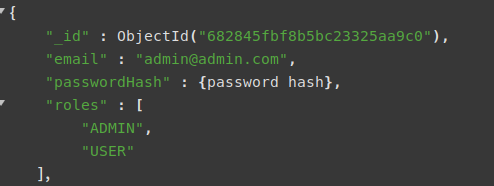
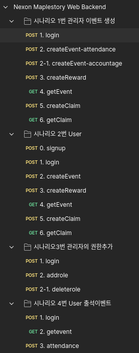

## Description

Event platform 레파지토리 입니다.

## Project setup

```bash
$ npm install 
```

## Compile and run the project for dev

```bash
# gateway
$ npm run dev:gateway

# auth
$ npm run dev:auth

# event
$ npm run dev:event

# run all 
$ npm run dev
```

## Build docker

```bash
# run build script
$ chmod +x ./build.sh # 필요시 sudo 권한으로 실행

$ ./build.sh

```

## Use docker compose

```bash
# docker compose with build
docker-compose up --build
# different env file
AUTH_ENV_FILE={AUTH_ENV_FILE_PATH} \
GATEWAY_ENV_FILE={GATEWAY_ENV_FILE_PATH} \
EVENT_ENV_FILE={EVENT_ENV_FILE_PATH} \
docker-compose up --build # run with docker compose
```


## Environment

```text
MONGO_URI={MONGODB_URI} // ex) mongodb://localhost:27017/event-platform, mongodb://host.docker.internal:27017/event-platform
BCRYPT_SALT_ROUNDS=12
JWT_SECRET="{JWT_SECRET}" // create with "openssl rand -base64 64"
AUTH_BASE_URL={AUTH_SERVER_URL} //in dev localhost:3001
EVENT_BASE_URL={EVENT_SERVER_URL}// in dev localhost:3002

```
ubuntu 22.04 환경에서 테스트 되었으며, mongodb 7.0.20 버젼 사용하였습니다.

## About docker compose
테스트를 위해 auth, event 서버도 포트를 바인딩하였지만, 실제 사용환경에서는 포트바인딩이 필요 없습니다.

하지만 gateway 포트만 노출시킨다면 큰 문제는 발생하지 않을 것으로 생각됩니다.

## Idea
### 1. Monorepo vs Multirepo

&emsp;&emsp;공통 코드(Guard·DTO·enum 등) 재사용을 위해 한 곳에 모듈화(libs/common) 기능이 많아지기 전에는 복제 없이 빠른 개발이 유리하다고 판단하였습니다.

### 2. Redis 미사용

&emsp;&emsp;AccessToken·RefreshToken 조회 빈도가 당장 높지 않아 Redis 사용은 오버엔지니어링이라고 판단하였습니다. 추후 필요 시 세션·토큰 캐싱 레이어로 도입 검토 가능합니다.

### 3. Nestjs Microservice 미사용

&emsp;&emsp;Gateway 서버는 현재 다른 서버로 프록시역할만 담당하고 있습니다. 추후 확장시 다른 서비스들 (aws apigateway 등)과 연동할 경우 Nestjs microserivce 사용보다 http 프록시로 기능하게 하는것이 유리하다고 판단하였습니다.

### 4. 로그인시 패스워드 정책

&emsp;&emsp;패스워드 정책은 Nexon members의 영문/숫자/특수문자 조합 10~16자를 사용하였습니다. class-validator 사용으로 DTO단계에서 검증합니다.

### 5. event 조건 확장성.
  
&emsp;&emsp;EventConditionType Enum과 IConditionChecker 인터페이스로 새 검증전략을 손쉽게 추가 가능합니다. 
ACCOUNT_AGE(계정생성일 기준), ATTENDANCE_STREAK(연속출석)이벤트를 구현하였습니다.

### 6. reward

&emsp;&emsp;보상의 종류는 다양하게 제공될 수 있습니다. 그렇기 때문에 과한 구조화보다 문자열 type으로 다양한 보상을 추가할 수 있게 설계하였습니다.

### 7. 이벤트 확장

&emsp;&emsp;이벤트 종류가 다양해질수록 이벤트 조건 충족을 이벤트/보상관리 플랫폼에서 검사하는 것 보다, 다른 서버에서 이벤트 조건을 충족하였는지 조회할 수 있게 분리하는 것이 좋아보입니다. 

### 8. 최초 admin

&emsp;&emsp;숨겨진 endpoint를 auth서버에 만들어 첫 ADMIN 계정 추가기능을 고려하였으나, 최초 ADMIN은 DB 직접 수정으로 결정하였습니다.

### 9. Proxy Http instance
&emsp;&emsp;AUTH_HTTP_SERVICE /EVENT_HTTP_SERVICE 토큰으로 각각 다른 HTTPService를 주입합니다. 

## Test
Postman을 이용한 E2E 테스트 컬렉션이 제공됩니다
```
./test/Nexon_Maplestory_Web_backend.postman_collection.json // 테스트 구현

./test/Nexon_web_backend.postman_environment.json //환경변수
```




환경변수 파일을 가져오신 뒤, 환경변수의 adminMail, adminPassword로 /auth/signup api를 사용하여 계정을 추가한 뒤, 

users collection에서 Admin 권한을 추가해야합니다.



테스트 컬렉션을 실행해 보세요.

문제가 있을 경우 dlgustjr02124@gmail.com 으로 연락 부탁드립니다.


## Endpoint
### Overview
#### Auth
| Method | Path            | Description      | Auth        |
| ------ | --------------- | ---------------- | ----------- |
| POST   | `/auth/signup`  | 회원 가입            | Public      |
| POST   | `/auth/login`   | 로그인              | Public      |
| POST   | `/auth/refresh` | AccessToken 갱신   | Public (RT) |
| POST   | `/auth/logout`  | 로그아웃             | Bearer JWT  |
| POST   | `/auth/role`    | 역할 추가 (Admin 전용) | Bearer JWT  |
| POST   | `/auth/remove-role`    | 역할 삭제 (Admin 전용) | Bearer JWT  |
#### Event
| Method | Path                       | Description | Roles                          |                                |
| ------ | -------------------------- | ----------- | ------------------------------ | ------------------------------ |
| GET    | `/event?active=true`     | 이벤트 목록 (활성/비활성 필터)             | USER, OPERATOR, AUDITOR, ADMIN |
| GET    | `/event/:id`              | 단일 이벤트 조회   | USER, OPERATOR, AUDITOR, ADMIN |                                |
| POST   | `/event/create`           | 이벤트 생성      | OPERATOR, ADMIN                |                                |

#### Rewards
| Method | Path                                        | Description                | Roles                          |
| ------ | ------------------------------------------- | -------------------------- | ------------------------------ |
| POST   | `/reward`                            | 보상 생성 | OPERATOR, ADMIN          |
| GET    | `/reward?eventId=<id>`                     | 보상 목록 (특정 이벤트 필터)          | USER, OPERATOR, AUDITOR, ADMIN |
| POST   | `/reward/claim`                            | 보상 요청 (중복·조건 검증 후 PENDING) | USER, OPERATOR, ADMIN          |
| GET    | `/reward/claim?userId=&rewardId=&status=` | 요청 이력 조회 (본인/전체/필터)        | USER, OPERATOR, AUDITOR, ADMIN |

#### Attendance
| Method | Path          | Body                       | Description | Roles |
| ------ | ------------- | -------------------------- | ----------- | ----- |
| POST   | `/attendance` | `{ "date": "YYYY-MM-DD" }` | 출석 기록 등록    | USER  |


### Body
POST /auth/signup 회원 가입용 엔드포인트입니다. 
```
//body
{
    "email" : {{userMail}},
    "password": {{userPassword}}
}
```

POST /auth/login 로그인 엔드포인트입니다.
```
//body
{
    "email" : {{userMail}},
    "password": {{userPassword}}
}
```

POST /auth/refresh accessToken을 refresh합니다

POST /auth/logout 로그아웃 엔드포인트입니다.

POST /auth/role 권한을 추가합니다. Admin 권한을 가진 계정만 호출할 수 있습니다.
```
//body
{
    "email": {{userMail}},
    "role": "ADMIN"
}
```
POST /auth/remove-role 권한을 삭제합니다. Admin 권한을 가진 계정만 호출할 수 있습니다. body 내용이 필요하여 DELETE 대신 POST를 사용하였습니다.
```
//body
{
    "email": {{userMail}},
    "role": "ADMIN"
}
```

GET /event event의 목록을 가져옵니다. query "active=true or active=false"를 통해 활성화여부로 쿼리할 수 있습니다.

이벤트의 내용에는 보상의 id가 리스트로 포함되어 관리됩니다.


GET /event/:id event 목록의 id를 통해 단일 쿼리가 가능합니다.

POST /event/create event를 생성합니다. operator, admin 권한을 가진 계정만 호출가능합니다.
```
//body
{
    "title": {이벤트이름},
    "conditionType": {이벤트 유형},
    "conditionMeta": {"days": 7},
    "startAt": {이벤트 시작시간},
    "endAt": {이벤트 종료시간}",
    "active": "false" //활성화 여부
}
```
POST /reward reward를 생성합니다. reward는 eventid를 포함하고 있어, event 달성시 어떤 reward가 주어질지 지정할 수 있습니다.
```
//body
{
    "eventId": "{{createdEventID}}",
    "type": {{meso}},
    "amount": 100
}
```
GET /reward reward의 목록을 조회합니다. query "eventId = " 를 통해 event에 어떤 보상이 할당되었는지 알 수 있습니다.

POST /reward/claim 보상을 요청합니다.
```
{
    "eventId": "{{createdEventID}}"
}
```

GET /reward/claim claim의 목록을 조회합니다.

user는 자신의 claim만 조회할수 있지만
다른 권한의 계정은 아래와 같은 인자로 조회할 수 있습니다.
```
{
  userId?: string;
  rewardId?: string;
  status?: 'PENDING' | 'REJECTED' | 'APPROVED';
}
```

POST /attendance 출석체크 기록 엔드포인트입니다.
```
{
 "date": "YYYY-MM-DD";
}
```

